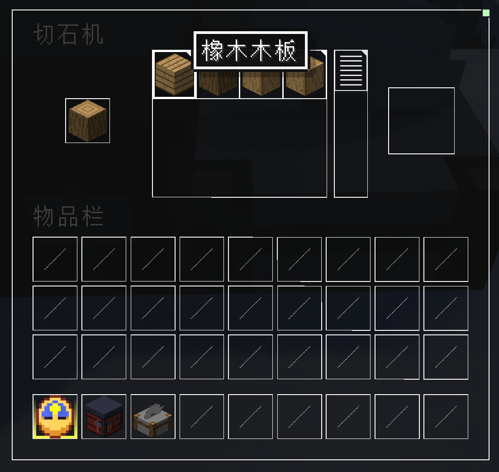
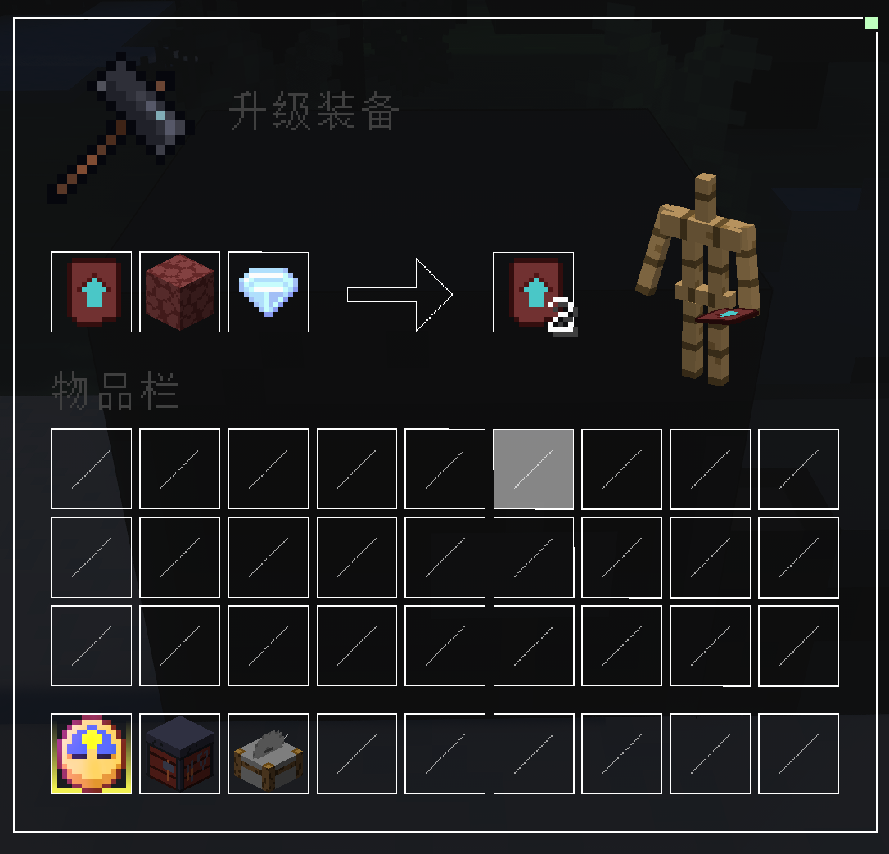

<h1 align="center"> Mr Fat Datapack </h1>

    

## 📋 简介

该数据包专为 Mr Fat 服务器设计
内含多种功能
适用于服务端 Minecraft 1.21

该仓库同时包含 ChestCommands 箱子菜单内容

## ❇️ 优势

### 运行高效
使用 advancement 与 schedule 替代 ticks 函数
运行更加高效

## 📖 游戏内容

### 自动睡觉

- 自动睡觉以跳过夜晚
- 玩家可以是否需要自动跳过夜晚

### 自动清理

- 自动清理掉落物
- 保障服务器运行流畅

### 补齐配方

- 切石机 可制作各种木板木棍
- 锻造台 可复制锻造模板 使用更少的材料
- 营火 烧制腐肉变成皮革

## ✅ 下载安装
前往 Release 界面 [⬇️下载](https://github.com/wen-wen520/Minecraft_Datapack-Mr.Fat_Server/releases) 适合的数据包

将数据包放入服务器 Datapack 文件夹 中安装

## 📃 反馈建议

在 Github 提交 Issue 进行 [❗问题报告](https://github.com/wen-wen520/Minecraft_Datapack-Mr.Fat_Server/issues/new?assignees=wen-wen520&labels=%F0%9F%90%9B+%E9%97%AE%E9%A2%98&projects=&template=bug_report.yml&title=%5BBug%5D+%E6%A0%87%E9%A2%98)

也可以 提交 Issue 建议 [💡新的功能](https://github.com/wen-wen520/Minecraft_Datapack-Mr.Fat_Server/issues/new?assignees=wen-wen520&labels=%F0%9F%92%A1+%E5%8A%9F%E8%83%BD&projects=&template=feature_request.yml&title=%5BFeature%5D+%E6%A0%87%E9%A2%98)

## 🔗 关联项目

[misode.github.io](https://github.com/misode/misode.github.io) 提供数据包跨版本服务

[crafting.thedestruc7i0n.ca](https://crafting.thedestruc7i0n.ca/) 为游戏进度提供支持

[高亮透视](https://github.com/sheep-realms) 演示材质包 - 1

[Barebones](https://modrinth.com/resourcepack/bare-bones) 演示材质包 - 2